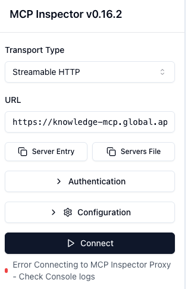
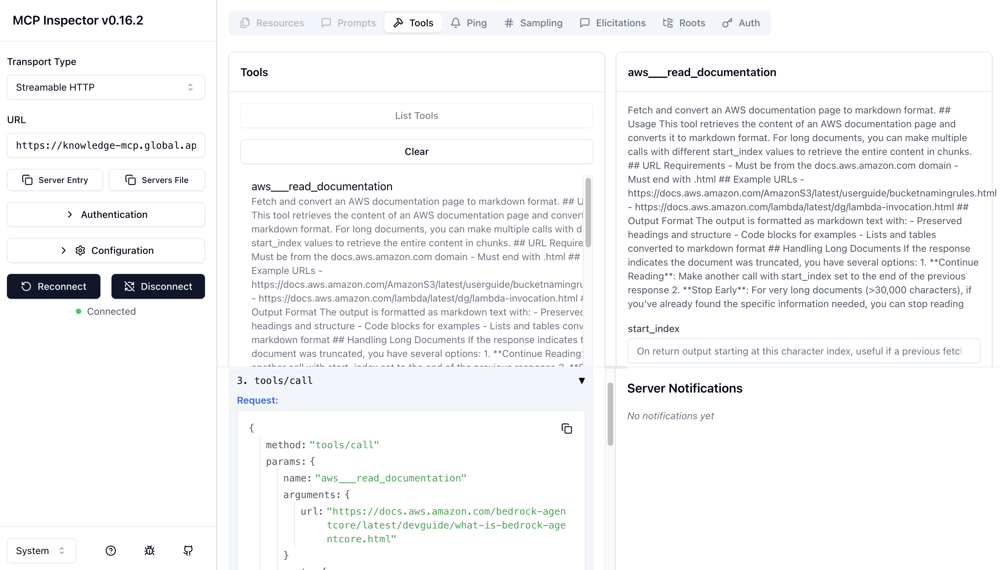

# 3_mcp_agent.py実行時エラー

手順通りに実装した場合も、みのるんさんのGitHubからコピペした場合も、同じエラーが起きました。

```terminal
$ python 3_mcp_agent.py 

unhandled exception during asyncio.run() shutdown
task: <Task finished name='Task-2' coro=<load_mcp_tools() done, defined at /usr/local/python/3.12.1/lib/python3.12/site-packages/langchain_mcp_adapters/tools.py:144> exception=UnboundLocalError("cannot access local variable 'tools' where it is not associated with a value")>
  + Exception Group Traceback (most recent call last):
  |   File "/usr/local/python/3.12.1/lib/python3.12/asyncio/runners.py", line 194, in run
  |     return runner.run(main)
  |            ^^^^^^^^^^^^^^^^

(略)

During handling of the above exception, another exception occurred:

Traceback (most recent call last):
  File "/usr/local/python/3.12.1/lib/python3.12/site-packages/langchain_mcp_adapters/tools.py", line 175, in load_mcp_tools
    convert_mcp_tool_to_langchain_tool(session, tool, connection=connection) for tool in tools
                                                                                         ^^^^^
UnboundLocalError: cannot access local variable 'tools' where it is not associated with a value
  + Exception Group Traceback (most recent call last):
  |   File "/workspaces/agent-handson/chapter4/3_mcp_agent.py", line 97, in <module>
  |     asyncio.run(main())
  |   File "/usr/local/python/3.12.1/lib/python3.12/asyncio/runners.py", line 194, in run
  |     return runner.run(main)
  |            ^^^^^^^^^^^^^^^^

(略)
```

## mcp-remoteを使う方法へ切り替える

少し実装を変えて、[ドキュメントに記載されていたmcp-remoteを使う方法へ切り替え](https://github.com/awslabs/mcp/tree/main/src/aws-knowledge-mcp-server)ましたが、接続はできませんでした。
エラー内容は別で、CloudFrontによる403エラーだったので、WAFに引っかかっているのかも…と思いました。

```terminal
$ python 3_mcp_agent.py 

[83990] Using automatically selected callback port: 46565 idealTree:#root Completed in 102ms
[83990] [83990] Connecting to remote server: https://knowledge-mcp.global.api.aws
[83990] Using transport strategy: http-first
[83990] Connection error: Error: Error POSTing to endpoint (HTTP 403): <!DOCTYPE HTML PUBLIC "-//W3C//DTD HTML 4.01 Transitional//EN" "http://www.w3.org/TR/html4/loose.dtd">
<HTML><HEAD><META HTTP-EQUIV="Content-Type" CONTENT="text/html; charset=iso-8859-1">
<TITLE>ERROR: The request could not be satisfied</TITLE>
</HEAD><BODY>
<H1>403 ERROR</H1>
<H2>The request could not be satisfied.</H2>
<HR noshade size="1px">
Request blocked.
We can't connect to the server for this app or website at this time. There might be too much traffic or a configuration error. Try again later, or contact the app or website owner.
<BR clear="all">
If you provide content to customers through CloudFront, you can find steps to troubleshoot and help prevent this error by reviewing the CloudFront documentation.
<BR clear="all">
<HR noshade size="1px">
<PRE>
Generated by cloudfront (CloudFront)
Request ID: SuUxBkLcPGTcydAHkBeu-wZfXsXe6V3GhsoHgRlisyO2kgKgDSx0rg==
</PRE>
<ADDRESS>
</ADDRESS>
</BODY></HTML>
    at StreamableHTTPClientTransport.send (file:///home/codespace/.npm/_npx/705d23756ff7dacc/node_modules/mcp-remote/dist/chunk-OXNXVROF.js:13266:15)
    at process.processTicksAndRejections (node:internal/process/task_queues:105:5)
[83990] Fatal error: Error: Error POSTing to endpoint (HTTP 403): <!DOCTYPE HTML PUBLIC "-//W3C//DTD HTML 4.01 Transitional//EN" "http://www.w3.org/TR/html4/loose.dtd">
<HTML><HEAD><META HTTP-EQUIV="Content-Type" CONTENT="text/html; charset=iso-8859-1">
<TITLE>ERROR: The request could not be satisfied</TITLE>
</HEAD><BODY>
<H1>403 ERROR</H1>
<H2>The request could not be satisfied.</H2>
<HR noshade size="1px">
Request blocked.
We can't connect to the server for this app or website at this time. There might be too much traffic or a configuration error. Try again later, or contact the app or website owner.
<BR clear="all">
If you provide content to customers through CloudFront, you can find steps to troubleshoot and help prevent this error by reviewing the CloudFront documentation.
<BR clear="all">
<HR noshade size="1px">
<PRE>
Generated by cloudfront (CloudFront)
Request ID: SuUxBkLcPGTcydAHkBeu-wZfXsXe6V3GhsoHgRlisyO2kgKgDSx0rg==
</PRE>
<ADDRESS>
</ADDRESS>
</BODY></HTML>
    at StreamableHTTPClientTransport.send (file:///home/codespace/.npm/_npx/705d23756ff7dacc/node_modules/mcp-remote/dist/chunk-OXNXVROF.js:13266:15)
    at process.processTicksAndRejections (node:internal/process/task_queues:105:5)
unhandled exception during asyncio.run() shutdown
task: <Task finished name='Task-2' coro=<load_mcp_tools() done, defined at /usr/local/python/3.12.1/lib/python3.12/site-packages/langchain_mcp_adapters/tools.py:144> exception=UnboundLocalError("cannot access local variable 'tools' where it is not associated with a value")>
  + Exception Group Traceback (most recent call last):
  |   File "/usr/local/python/3.12.1/lib/python3.12/asyncio/runners.py", line 194, in run
  |     return runner.run(main)
  |            ^^^^^^^^^^^^^^^^

(略)
```

## @modelcontextprotocol/inspectorでの接続確認

ブラウザは開いたものの、MCPサーバーへ接続できず。

```terminal
$ npx @modelcontextprotocol/inspector https://knowledge-mcp.global.api.aws
Need to install the following packages:
@modelcontextprotocol/inspector@0.16.2
Ok to proceed? (y) y
Starting MCP inspector...
⚙️ Proxy server listening on localhost:6277
🔑 Session token: **************************************
   Use this token to authenticate requests or set DANGEROUSLY_OMIT_AUTH=true to disable auth

🚀 MCP Inspector is up and running at:
   http://localhost:6274/?MCP_PROXY_AUTH_TOKEN=**************************************

🌐 Opening browser...
```



## 比較：ローカル環境で動かす

原因切り分けの一環として、ローカル環境でも同じコードを用意し、動かしてみました。


### VSCodeターミナルで@modelcontextprotocol/inspectorを実行

こちらは問題なく接続でき、ツール実行までできました。



## 

